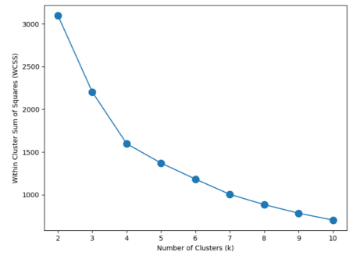
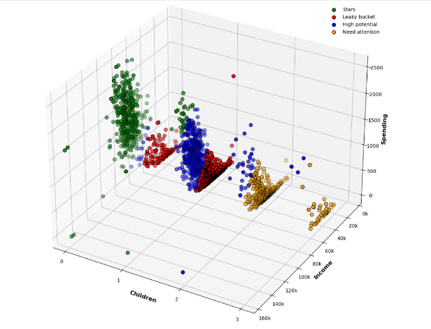
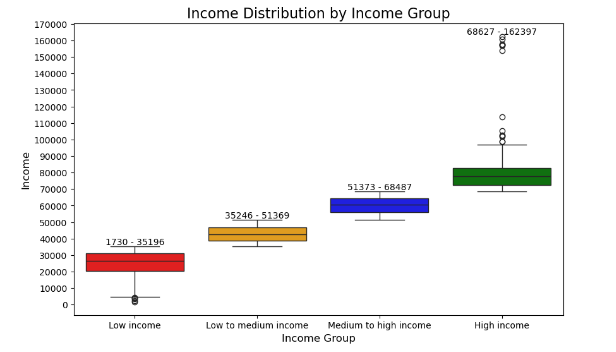
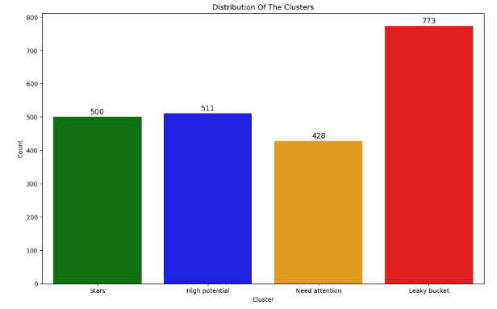
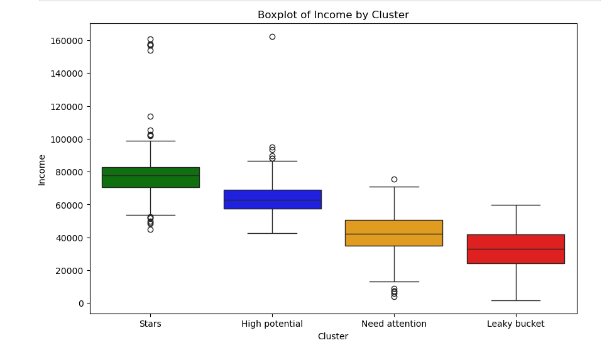
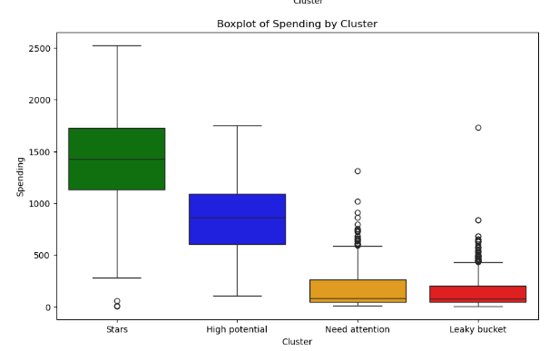
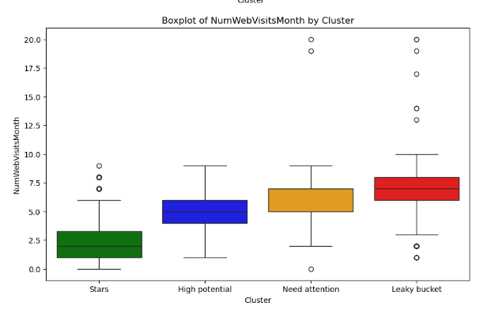


**Project Name: Customer Personality Analysis **

**Project Overview**

Customer Personality Analysis comprehensively examines a company's ideal customer base. It enables businesses to gain deeper insights into their customers' preferences, behaviors, and pain points. This understanding helps tailor products and services to meet the specific needs of different customer segments, improving customer satisfaction and driving business growth.

**Business Case:** https://github.com/camellikna/Team\_Project/blob/main/BusinessCase.md

**Code:** https://github.com/camellikna/Team\_Project/blob/main/src/Data\_Preprocessing\_Clustering.ipynb

**Data:** https://github.com/camellikna/Team\_Project/blob/main/data/raw/marketing\_campaign.csv

**Team Members**

\- Camelia Najafi

\- Omar Khan

\- Gang Huo

\- Heidi Ghafoor

\- Iryna Horodetska

` `**Project Phases**

The project is divided into the following key phases:

Here's your project description with enhancements for clarity, readability, and professionalism, while keeping all original content intact:

-----
## Customer Personality Analysis (Team Project 1)
### Project Overview
Customer Personality Analysis comprehensively examines a company's ideal customer base. It enables businesses to gain deeper insights into their customers' preferences, behaviors, and pain points. This understanding helps tailor products and services to meet the specific needs of different customer segments, improving customer satisfaction and driving business growth.

**Business Case:** [Customer Personality Analysis Business Case](https://github.com/camellikna/Team_Project/blob/main/BusinessCase.md)
**Code Repository:** [Data Preprocessing and Clustering](https://github.com/camellikna/Team_Project/blob/main/src/Data_Preprocessing_Clustering.ipynb)
**Dataset:** [Marketing Campaign Dataset](https://github.com/camellikna/Team_Project/blob/main/data/raw/marketing_campaign.csv)

-----
### Team Members
- **Camelia Najafi**
- **Omar Khan**
- **Gang Huo**
- **Heidi Ghafoor**
- **Iryna Horodetska**
-----
### Project Phases
#### *1. Writing the Business Case*
- Defined the objectives, scope, and value proposition of the customer personality analysis.
#### *2. Loading and Exploring Data*
- Loaded the dataset and performed initial checks to ensure data quality and integrity.
- Identified and addressed null values.
#### *3. Data Cleaning and Feature Engineering*
**3.1 Data Cleaning:**

- Removed redundant columns and columns with only one unique value.
- Converted Dt\_Customer to a DateTime format.
- Calculated the **Tenure (Days as Customer)** of each customer.
  - Assumed an anchor date of '2014-08-29' (2 months or 61 days after the most recent customer's Dt\_Customer date).

**3.2 Handling Outliers and Missing Data:**

- Cleaned invalid and outlier values in the Age column.
- Managed outliers and missing values in the Income column.

**3.3 Categorical Feature Segmentation:**

- Segmented Marital\_Status into two meaningful groups.
- Grouped Education into three distinct categories.
- Removed leading and trailing spaces in column names for consistency.

**3.4 Feature Creation:**

- Calculated new features such as:
  - **Total Spending:** Aggregated spending across all product categories.
  - **Total Purchases:** Summed the number of purchases across all products.
  - **Total Accepted Campaign Offers:** Counted the number of campaigns accepted.
  - **Parenthood Status:** Created a Has\_Child feature to indicate whether a customer has children.
- Renamed columns for clarity:
  - MntWines → Wines
  - MntFruits → Fruits
  - MntMeatProducts → Meat
  - MntFishProducts → Fish
  - MntSweetProducts → Sweets
  - MntGoldProds → Gold     
#### *4. Exploratory Data Analysis (EDA) and Visualization*
**4.1 Correlation Analysis:**

- Found a strong correlation between **TotalNumPurchases** and **Spending**, leading to the decision to focus on spending for clustering.

**4.2 Feature Distribution Exploration:**

- Visualized distributions and identified key patterns using histograms and scatter plots.
- Example insights:
  - Spending behavior varies significantly across age groups and tenure.
  - Income distribution shows notable outliers, impacting overall spending trends.
####
#### ***5**. Exploratory Data Analysis and Data Visualization*
`  `5.1 Analyze the correlations among the three spending features

TotalNumPurchases and Spending are strongly correlated. To simplify the clustering analysis, we chose only one key feature: Spending. 

`  `5.2 Exploring the distribution of features

`  `

`  `

#### *6. Correlation Analysis and Visualization*

Income and spending are continuous numerical variables, but not normally distributed.

Some features like Children and AcceptedCmps are multinomial categorical variables (ordinal variables), and Age and Tenure are discrete variables.

Therefore, we choose the spearman correlation method.

#### ***7.** Clustering Analysis*
KMeans Clustering

**7.1 Elbow Method to determine the optimal number of clusters**

The elbow plot indicates that **the optimal number of clusters is 4.**

**7.2 Perform K-means clustering**

**7.3 Data Transformation for Customer Personality Analysis**

**7.4 Customer Personality Analysis using Apriori Algorithm**

**7.5 Clusters Analysis and Customers Profiling**

**…**

**And lots of Chart to show clustering that mention in our code**

#### *Clusters Conclusions*
**Stars (Cluster 0):**

- Highest income (78k), highest spending (1430) and high purchasing frequency
- More than 90% has no child, less than 10% has one child
- More than 60% has a partner
- Mainly graduate or postgraduate
- Occasionally accept promotions
- Show lowest number of web visits
- Span all ages
- High consumers for meat, wines, fish and sweets

**High Potential (Cluster 2):**

- Majority are medium income (63k), some are high income, few below medium income
- Moderate spending (860) but highest purchasing frequency
- Majority have a parnter
- More than 90% has one child, small portion has two children, very few has no child
- Majority are mature and adult, very few young or senior people
- Mainly graduate or postgraduate
- Rarely accept promotions

**Need attention (Cluster 3):**

- Medium income (42k) and low spending (170)
- Majority have two children, small portion have three children
- Majority are adult and mature
- Majority have a partner
- Low purchasing frequency
- Occasionally made some purchases with a discount
- Do not accept promotions

**Leaky bucket (Cluster 1):**

- Low income (33k) and low spending (140)
- Majority have one child, some have no child
- Have relatively larger portions of adult and young people
- Majority have a partner
- Low purchasing frequency
- Do not accept promotions

**Project Timeline**

-2024-10-16

`   `Initial session: We reviewed multiple datasets and discussed their relevance to our project. After careful consideration, we decided that each group member would explore datasets related to retail, narrowing down our choices to five options.

\- 2024-10-17

`   `Dataset selection: The team finalized the choice of the dataset and began initial data exploration.

\- 2024-10-18

`   `Data surfacing: Continued to surface and analyze the selected dataset, preparing for further stages of analysis and visualization.

2024-11-10   --- 2024-11-30

Checking code and adding visualization and clustering

2024-12-09

Adding information to ReadMe and Check code

**Conclusion**

The **Customer Personality Analysis** project successfully demonstrated how businesses in the retail sector can leverage data-driven insights to enhance customer engagement, tailor services, and optimize marketing strategies. By cleaning, preprocessing, and analyzing data, our team was able to segment customers into meaningful clusters and uncover patterns that drive spending behaviors and customer loyalty.

Key achievements include:

1. Identifying actionable clusters such as **Stars**, **High Potential**, **Need Attention**, and **Leaky Bucket**, each with distinct characteristics and actionable recommendations for targeting.
1. Developing comprehensive data preprocessing and cleaning strategies to ensure high-quality inputs for analysis.
1. Applying advanced clustering techniques like **KMeans** and the **Apriori Algorithm** to understand customer behaviors deeply.
1. Visualizing complex data relationships to make insights accessible and impactful for decision-makers.

This project highlights the importance of rigorous data analysis and collaboration in addressing real-world business challenges. The results can serve as a foundation for businesses aiming to enhance customer satisfaction, improve profitability, and create personalized experiences.

By adhering to a structured timeline and leveraging team strengths, we achieved a robust analysis that underscores the value of teamwork, strategic planning, and technical expertise in delivering data-driven solutions.

